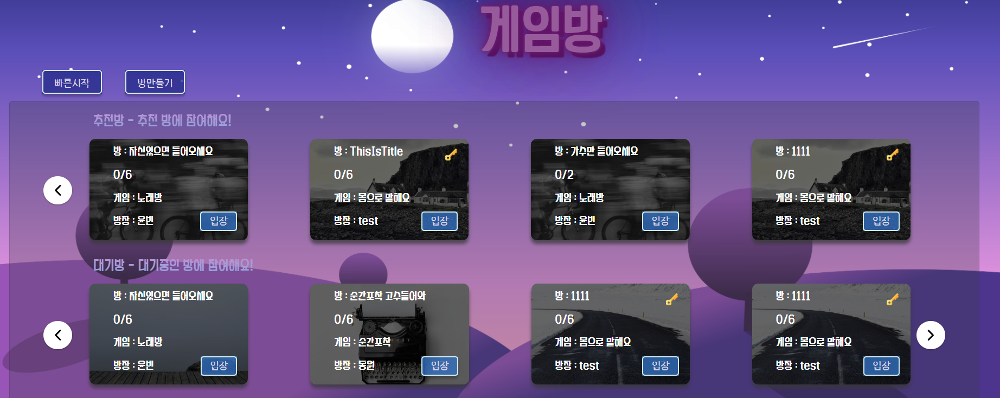
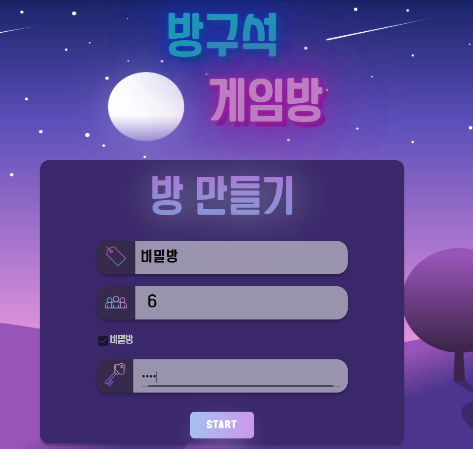
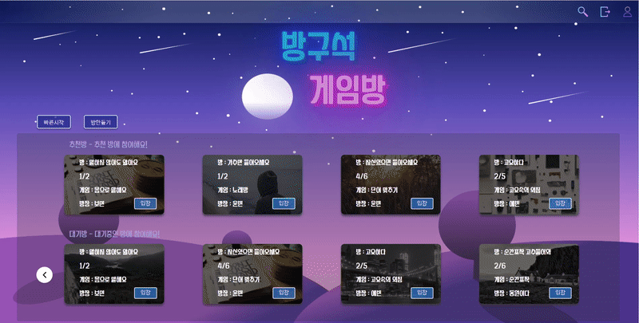
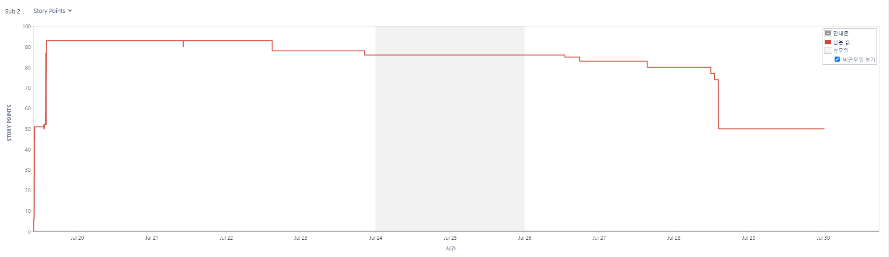
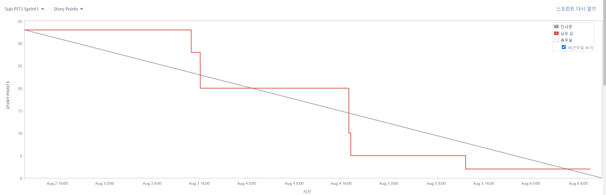
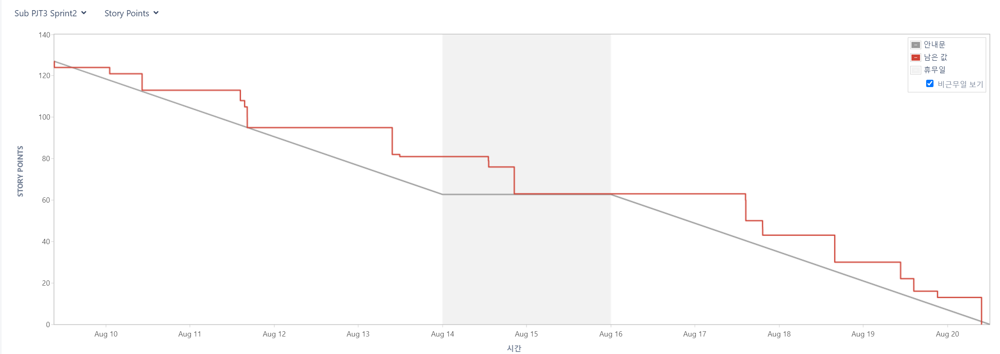
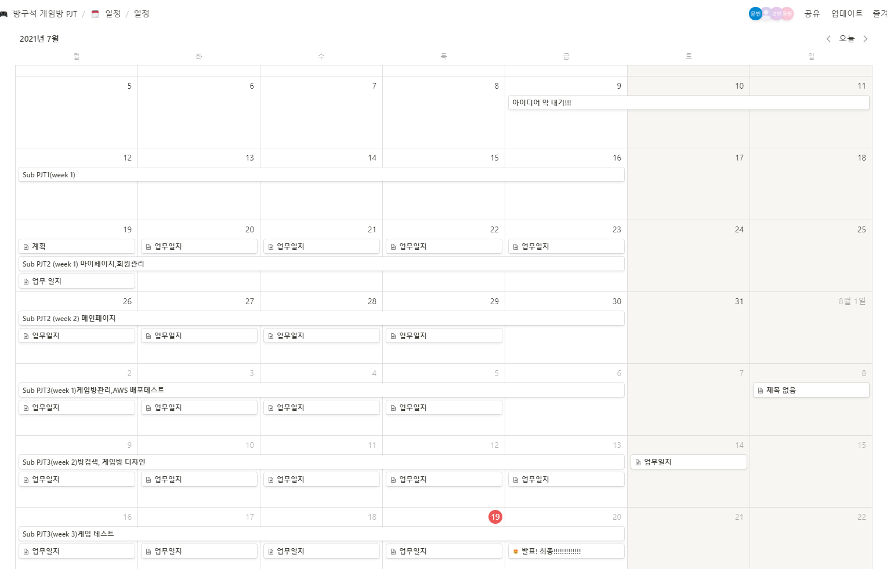

> **방구석 게임방 :video_game:**
>
> 화상 기반 랜선 게임 플랫폼 

팀장 : `권예빈`

팀원 : `김보민`,` 김윤빈`, `정동원`

## 📆 프로젝트 개요 

              

<br>

- **진행 기간** : 2021.07.21~ 2021.08.20
  
  * Sub PJT1 :  7/12-  7/16
  * Sub PJT2 : 7/19- 7/30
  * Sub PJT3 : 8/2 - 8/20
    * Sprint1 : 8/2 - 8/6
    * Spring2: 8/9 - 8/20
- **목표**
  
  - 온라인으로 서로 소통하며 게임을 즐길 수 있는 화상 게임 서비스를 개발합니다. 
  - 온라인 화상으로도 게임의 즐거움을 충분히 느낄 수 있도록 UX/UI를 설계합니다.
  - 코로나19의 사회적거리두기로 인한 외로움 해소를 목표로 합니다.
  
  

* **Sub PJT2 배포링크**

  http://i5c104.p.ssafy.io/

* **기획 및 요구사항정의**

  [기획안](https://spangle-dive-0b6.notion.site/e13cee0a62d344ec914af6c46bc48b1e)

- **Wireframe**
  
  - [와이어프레임 링크](https://www.figma.com/file/baTkJLA1PJCApXCzz7GJdZ/방구석게임방?node-id=0%3A1) 
  
  


- **ERD**

  - [ERD 링크](https://www.erdcloud.com/d/i2m7SoQ4TDpcjARp3)


- **API** 

  - [API 링크](https://documenter.getpostman.com/view/16839187/TzzBpFZd)


## 주요기능

> 사용자들이 서로 떨어져 있지만, 같이 게임을 하며 즐거운 분위기를 공유하며 느낄 수 있는 기능을 제공합니다.


### 게임

#### 몸으로 말해요

1.   


  - 랜덤으로 출제자를 골라 몸으로만 제시어를 설명 합니다. 출제자에게는 키워드를 보여주고 다른사람들이 맞추는 게임입니다.
  - 모든 게임들은 정답을 맞추면 채팅창에 정답을 알려주고 그 다음문제가 출제 됩니다.

<br>

#### 고요속의 외침


- 랜덤으로 출제자를 골라 마이크를 끄고 음성 없이 입모양으로만 제시어를 설명합니다.

<br>

#### 노래방


  - 유튜브 API를 활용해 노래를 같이 들으면서 노래를 부를 수 있습니다.

<br>

#### 순간포착


  - 순식간에 지나가는 사진을 보며 최대한 빨리 맞추는 사람이 승리하는 게임입니다. 
#### 글자 맞추기


  - 구멍이 뚫린 4글자 단어를 보고 빨리 맞추는 사람이 승리하는 게임입니다. 


### 공개방 / 비밀방 

- 새로운 사람들과의 소통을 즐길 수 있도록 공개방도 지원합니다.

- 
- 방 생성 시 비밀방으로 설정하여 비밀번호를 아는 사람만 들어올 수 있는 방을 생성할 수 있습니다.




- 방장의 이름이나 방 이름으로 검색하여 방을 입장할 수 있는 검색 기능을 지원합니다.

  - 

  


## 협업 툴 

> 협업을 위해 gitlab, JIra, notion을 사용합니다. 
>
> git을 통한 형상관리, jira를 통한 이슈 티켓 관리, 노션을 통한 기획, 업무일지 작성, 자료 공유를 하고 있습니다.


### Git Commit Convention

>git은 gitflow 전략을 통해 FE-BE를 나누고 feature에서 통합테스트를 거쳐 develop브랜치를 개발브랜치로 관리합니다. 
>
>master브랜치를 aws배포 브랜치로 사용하고 배포에서 긴급하게 수정이 필요하다면 hotfix 브랜치를 이용합니다. 


```
[이슈번호] 타입/브랜치명 : 행위단위 내용
```

- 타입

  - docs : 문서(리드미 등) 수정
  - fix : 버그 수정
  - feat : 새로운 기능 추가 ( a new feature)
  - refactor : 코드 리팩토링 (코드 정리 ,클린코드)

- 브랜치명

  - master(배포할 때? 마지막에) => 스프린트 끝날 때 사용

  - **develop**

  - feature/FE/큰기능단위/컴포넌트 (각각이 다 브랜치임)

    : 컴포넌트를 여러 사람이 작업하게 될 시 한 depth 더 들어가서 각자 브랜치에서 작업

  - feature/BE

- 행위 단위

  - Add
  - Update
  - Delete
  - Fix(버그 수정)

- 내용

  - 해당 commit에서 어떤 작업을 했는지 작성한다.


<br>

### **Jira**

> jira를 통해 이슈관리를 하고 있습니다 

- 깃 커밋에 들어갈 이슈번호는 '스토리' 이슈 단위로 작성한다.
- 회의를 통해 기능 추가
  
  * Sprint를 시작할 때 이슈의 Story point와 담당자를 정한다.

#### burn down chart

- Sub PJT2 Jira 소멸차트

  

* Sub PJT3 -1 Jira 소멸차트

    
    
* Sub PJT3-2 Jira 소멸차트

    * 

<br>

### Notion

> notion은 매일매일 업무일지를 작성하며 작업의 진행을 적어주고, 에러가 발생했을때 어떻게 해결했는지 공유하는 곳입니다. 또한 같이 알아야할 문서들을 정리하고 사용합니다.

- [notion 링크](https://spangle-dive-0b6.notion.site/36b6e17ba1a346d5a94bb6e3292e1268?v=ff7c138d2781458b889691b19d78bb6f)

- 

<br>

## Color


## 개발 환경

### Front-end

- **Framework** : Vue.js
- **지원 환경** : Web
- **담당자** : `권예빈`,`김보민`

<br>

### Back-end

- **Framework** : Spring boot 
- **Database** : MySQL
- **담당자** :  `김윤빈`, `정동원`

<br>

## ⚙ IDE

- Java : jdk11 (11.0.12)
- Docker : 20.10.7
- node.js : 14.17.3
- maven : Apache Maven 3.6.0
- gradle: 6.8.3
- openvidu : 2.19

<br>

## 😋 설치 가이드

- Frontend

```bash
$ cd frontend
$ npm i
$ npm run serve
```

- Backend

```bash
# API server 
$ cd Backend
$ gradle wrap # gradle wrapper 없을 경우 실행
$ ./gradlew clean build
$ sudo java -jar build/libs/ssafy-fifth-web-common-project-1.0-SNAPSHOT.jar

# openvidu KMS
$ docker run --rm -p8888:8888/tcp -p5000-5050:5000-5050/udp -e KMS_MIN_PORT=5000 -e KMS_MAX_PORT=5050 kurento/kurento-media-server:latest

# openvidu-server
$ cd ..
# /openvidu
$ sudo mvn package -DskipTests
$ cd openvidu-server/target 
$ java -jar openvidu-server-2.19.0.jar

```

<br>

## 🐤 Server Description

- port (nginx)

  - | 443               | server default(https)                                        |
    | ----------------- | ------------------------------------------------------------ |
    | **80**            | server default(http) (redirect to 443)                       |
    | **5443**          | openvidu (Spring boot running)                               |
    | **8080**          | REST API (Spring boot running) (reverse proxy)               |
    | **3478**          | used by TURN server to resolve clients IPs.                  |
    | **40000 - 57000** | used by Kurento Media Server to establish media connections. |
    | **57001 - 65535** | used by TURN server to establish relayed media connections.  |

