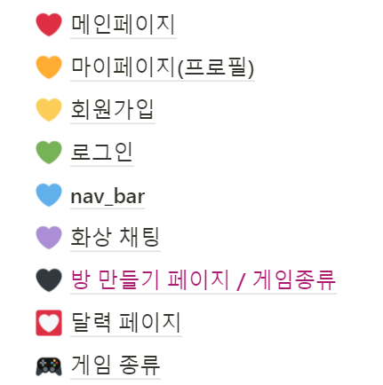
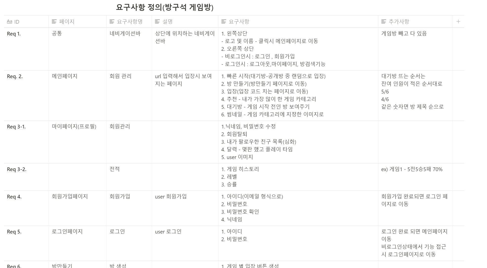
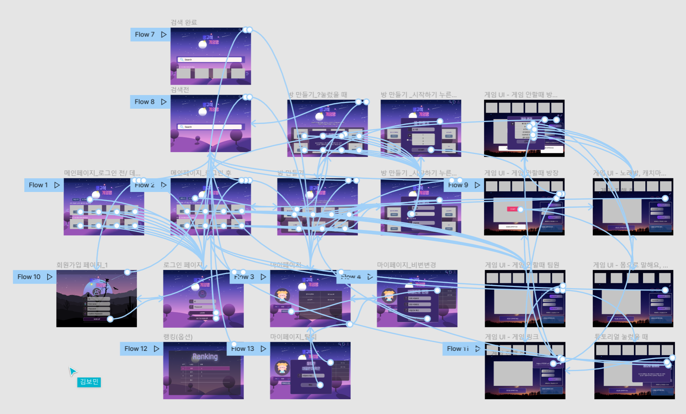
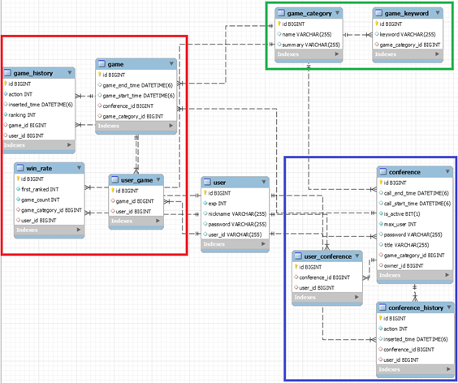
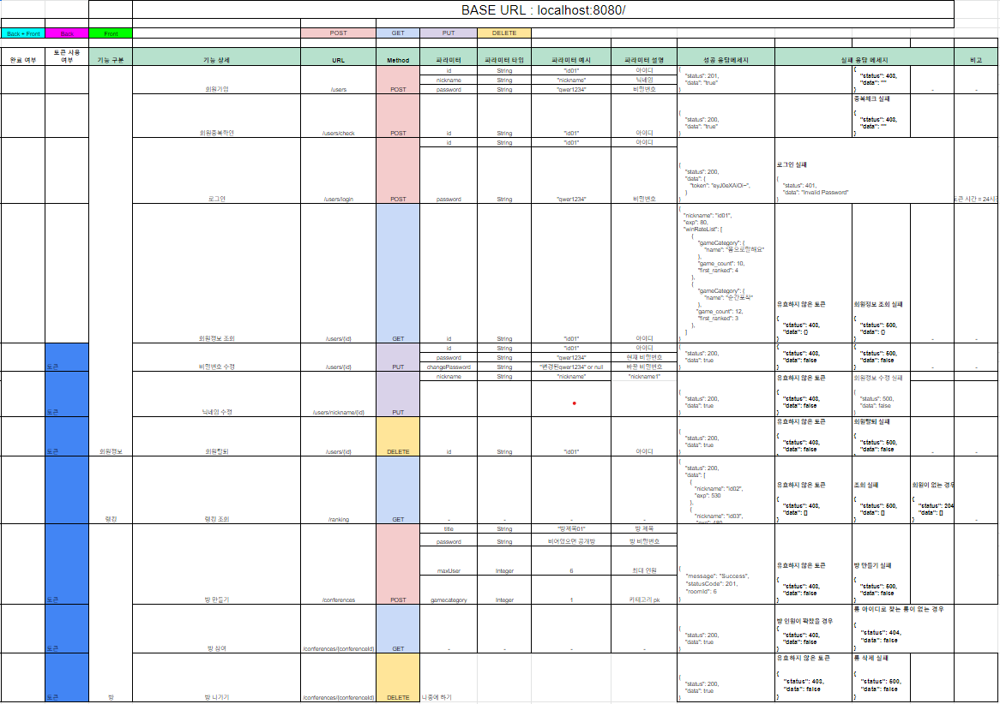
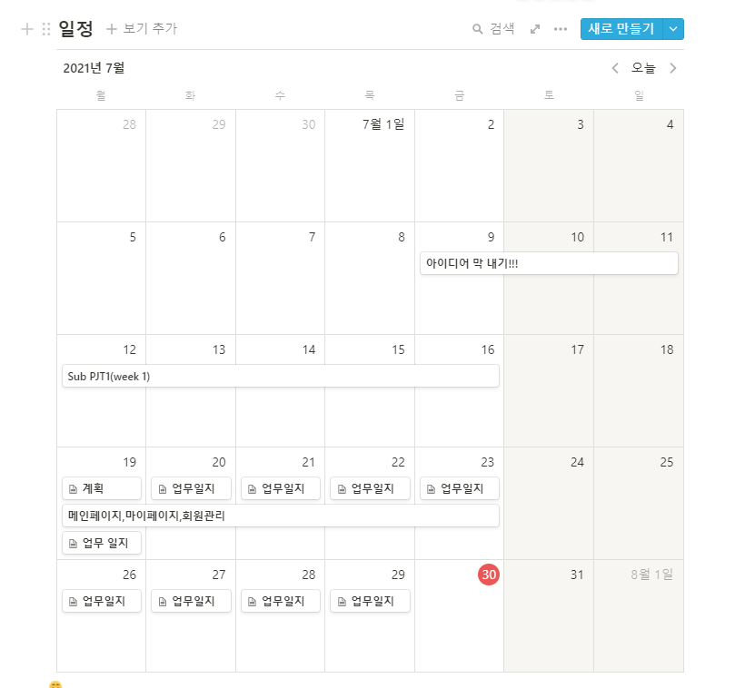

# 🎈 방구석 게임방

> 화상 기반 랜선 게임 플랫폼 

팀장 : `권예빈`

팀원 : `김보민`,` 김윤빈`, `정동원`

## 📆 프로젝트 개요 

- **진행 기간** : 2021.07.21~ 진행중
  * Sub PJT1 :  7/12-  7/16
  * Sub PJT2 : 7/19- 7/30
  * Sub PJT3 : 8/2 - 8/20
    * Sprint1 : 8/2 - 8/6
- **목표**
  - 온라인으로 서로 소통하며 게임을 즐길 수 있는 화상 게임 서비스를 개발합니다. 
  - 온라인 화상으로도 게임의 즐거움을 충분히 느낄 수 있도록 UX/UI를 설계합니다.
  - 코로나19의 사회적거리두기로 인한 외로움 해소를 목표로 합니다.

* **Sub PJT2 배포링크**

  http://i5c104.p.ssafy.io/

* **기획**

  [노션 링크](https://spangle-dive-0b6.notion.site/e13cee0a62d344ec914af6c46bc48b1e)

  

- **요구사항정의**
  
  [노션링크](https://spangle-dive-0b6.notion.site/e782d18cf0704b90b11ee7a7983dd049)
  
  
  
- **Wireframe**
  
  - [와이어프레임 링크](https://www.figma.com/file/baTkJLA1PJCApXCzz7GJdZ/방구석게임방?node-id=0%3A1) 
  
  
  
  
  
  


- **ERD**

	- [ERD 링크](https://www.erdcloud.com/d/i2m7SoQ4TDpcjARp3)
	
	


- **API** 

	- [API 링크](https://docs.google.com/spreadsheets/d/1Hv3eXslcOPa4mkrRWPYeclXQUAdBnyGK2AVYatX1-eU/edit#gid=1154573824)
	
	

- **Notion**

- [notion 링크](https://spangle-dive-0b6.notion.site/36b6e17ba1a346d5a94bb6e3292e1268?v=ff7c138d2781458b889691b19d78bb6f)

- 


## Git Commit Convention

```
[이슈번호] 타입/브랜치명 : 행위단위 내용
```

- 타입

  - docs : 문서(리드미 등) 수정
  - fix : 버그 수정
  - feat : 새로운 기능 추가 ( a new feature)
  - refactor : 코드 리팩토링 (코드 정리 ,클린코드)

- 브랜치명

  - master(배포할 때? 마지막에) => 스프린트 끝날 때 사용

  - **develop**

  - feature/FE/큰기능단위/컴포넌트 (각각이 다 브랜치임)

    : 컴포넌트를 여러 사람이 작업하게 될 시 한 depth 더 들어가서 각자 브랜치에서 작업

  - feature/BE

- 행위 단위

  - Add
  - Update
  - Delete
  - Fix(버그 수정)

- 내용

  - 해당 commit에서 어떤 작업을 했는지 작성한다.

## **Jira**

- 깃 커밋에 들어갈 이슈번호는 '스토리' 이슈 단위로 작성한다.
- 회의를 통해 기능 추가
  * Sprint를 시작할 때 이슈의 Story point와 담당자를 정한다.
  
- Sub PJT2 Jira 소멸차트

  

* Sub PJT3 -1 Jira 소멸차트

      

## 개발 환경

### Front-end

- **Framework** : Vue.js
- **지원 환경** : Web
- **담당자** : `권예빈`,`김보민`


### Back-end

- **Framework** : Spring boot 
- **Database** : MySQL
- **담당자** :  `김윤빈`, `정동원`

